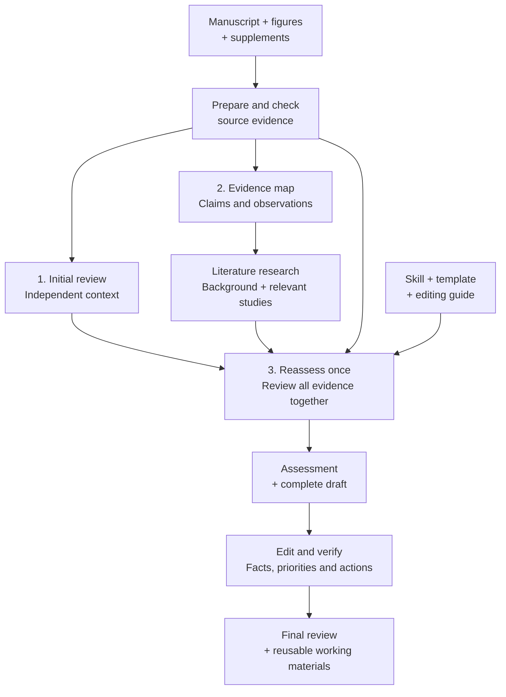

# Biomedical Peer Review

**Understand what a study establishes. Identify the changes that would most improve it.**

An AI skill for evaluating biomedical manuscripts and helping authors improve their research. It combines an independent initial review, a source-linked evidence map, literature research, and one informed scientific reassessment. The result is a prioritized review **and reusable research materials** that explain the study, its context, and its remaining uncertainties.

The workflow is organized around two questions:

- **What has this study actually established, and why does it matter?**
- **Which revisions or additional analyses would most improve its credibility and value?**

## How it works



**Steps 1, 2 and 3 are three separate generation calls.** The host assistant—the AI running the workflow in your session—handles source preparation, literature research, and editing around those calls. Those tasks also consume time and model usage; they are not included in the helper's generation-token totals.

The initial review stays hidden while the evidence map and literature notes are prepared. The final call then receives the complete packet, including the original manuscript and figures. The host edits and checks the saved draft before finalizing it; there is no separate default scoring or integration call.

### What each stage contributes

| Stage | Work performed | Useful result |
| --- | --- | --- |
| Initial review | Evaluate the manuscript in a fresh context without the skill, prior reviews, or preparation notes. | An independent starting assessment to retain, correct, or deepen. |
| Evidence map | Connect important claims to actual comparisons, biological units, measurements and results; separate observations from interpretations. | A navigable account of what was studied and what supports each claim. |
| Literature research | Establish the field background, then examine directly relevant studies. Record what each source contributes and what was actually accessible. | Context for judging significance, alternative explanations and useful improvements. |
| Scientific reassessment | Read the evidence and initial review together once, preserving sound judgments and revisiting consequential gaps. | A coherent assessment and complete review draft with prioritized actions. |
| Editing and verification | Check factual wording, repeated demands, sufficient alternatives, required versus optional work, and the selected template. | A checked review, with consequential edits documented separately. |

### The scientific questions

The reassessment considers three connected questions, then decides what findings to retain and what the authors should improve first.

| Perspective | Question |
| --- | --- |
| **Evidence** | What do the observations reliably show, under which conditions and with what uncertainty? |
| **Claims** | What has the study added to existing knowledge, and how well does the claimed contribution match its evidence? |
| **Links** | Does the reasoning hold from evidence to individual claims, and from those claims to the overall conclusion? |

These are open questions, not a checklist that must produce a criticism for every item. The scientific problem determines which biological, methodological, statistical or conceptual issues matter.

Revision requests should identify the claim they are needed to support. Some problems require new evidence; others can be resolved by reanalysis, clearer reporting, or a defensible narrowing of the claim. Optional strengthening should remain optional throughout the review.

## What you get

All paths below are relative to a **private run directory outside this repository**.

| Artifact | What you can use it for |
| --- | --- |
| `delivery/peer-review.md` | Read the concise final review and the author's revision priorities. |
| `delivery/full-review.md` | Revisit the source-checked detailed review before compression. |
| `runs/map/map.md` | Revisit the study design, claim–evidence relationships and source locations. |
| `literature/notes.md` | Reuse field background, relevant studies and their interpretive limits. |
| `assessment.md` | Quickly find the contribution, central uncertainty and highest-value actions identified during reassessment. |
| `review-dossier.md` | Read the map, literature notes, material judgment changes and limitations together. |
| `runs/baseline/review.md` | Compare the independent initial review with the informed reassessment. |
| `draft-review.md` | Inspect the preserved draft before host editing. |
| `delivery/editing-notes.md` | See what the host changed, why, and what remains unresolved. |

The assessment and dossier preserve the reassessment stage; subsequent corrections are recorded in the editing notes. The run also saves source inputs, selected visuals, prompts, responses, model settings, usage and provenance hashes. Hashes establish which files were used, not whether a scientific judgment is correct.

## Quick start

### Install in Codex

For a new installation:

```bash
git clone https://github.com/kohjy2000/biomedical-peer-review.git ~/.codex/skills/biomedical-peer-review
```

If that directory already contains the skill, inspect your existing installation before replacing it.

### Provide the review materials

Supply the manuscript PDF, figures and relevant supplements, the target journal, and any required review template. Specify the literature cutoff and output language if you need something other than a current-date review in English.

Then invoke the skill in your assistant session:

```text
Use $biomedical-peer-review to evaluate the attached manuscript and supplements
for [journal]. Explain what the study establishes, why it matters, and what the
authors should improve first.

Follow the full initial-review workflow. Research both the field background
and directly relevant prior studies. Use my attached review template, preserve
the intermediate materials, and save the checked final review and editing notes
in [private output directory]. Proceed with this review.
```

If your workspace requires a particular start-approval phrase, provide it explicitly. Independent contexts must receive the authorization they need; permission in the parent conversation should not simply be assumed to have transferred.

### Execution requirements

The included [Codex CLI helper](scripts/review_run.py) requires an authenticated, compatible Codex CLI and Python with `pypdf`, `pypdfium2`, and Pillow. The host needs literature-search and PDF-inspection tools. It prepares the visual plan and verifies that images preserve all relevant content and orientation. Complete native figure images are preferred; vector content, tables and uncertain extraction use full-page rendering. Scanned manuscripts need checked OCR before use.

Follow the [run guide](references/run.md) for preparation, the three generation calls, literature sealing, editing and finalization. The helper does not conduct literature searches or perform host editing itself. CLI isolation relies on version-specific flags; check compatibility rather than silently dropping isolation controls.

Use an available model configured for your environment and record it. All three calls in a run use the same model and reasoning settings. Other assistants can follow the workflow with equivalent independent contexts, but the supplied execution adapter is for Codex; cross-platform execution has not been validated here.

### Templates and other review tasks

Pass a supplied template as UTF-8 text with `prepare --template TEMPLATE.md`. The bundled default uses connected paragraphs under Overall Assessment, Major Comments, Minor Comments and Recommendation when requested. The final report targets 600–1,000 words, with exceptions when independent consequential issues need more space. The checked detailed review is preserved before compression; important reasons, sufficient remedies and valid alternatives must survive. User/journal instructions override this default. The selected template and editing guide are frozen and delivered to the final context.

For a revised submission, provide the previous review, response letter, revised manuscript and editor instructions, and use the [revision-review guidance](references/revision-review.md). A revision review intentionally uses that history. A bounded question or draft edit uses only the requested scope.

## What has been tested—and what remains uncertain

Local development has exercised the full workflow and compared intermediate materials, initial reviews, reassessments and edited reports. The runs showed useful evidence organization and more specific literature-informed judgments. They also showed that an initial review may already identify the central scientific concerns: more stages do not guarantee more discoveries or a better recommendation.

A full-workflow development trial used **GPT-5.6 Sol, high reasoning effort**, with three generation calls and no regeneration. It used a private runner adaptation to explicitly forward start authorization and a selected prose-style template. The bundled helper does not explicitly forward that start authorization, and that trial used a custom prose template; the default has since been changed to connected prose. That trial therefore does not demonstrate identical behavior from an unmodified default installation.

Factual phrasing and revision demands still needed correction during host editing. For example, an unclear replication description should first prompt clarification of existing samples, rather than an unconditional demand for new experiments. Editing is a substantive part of the workflow, not just formatting.

These are limited development observations, not an independent benchmark or a guarantee of completeness, cost efficiency, or superiority over an unassisted model. The [archived public-paper pilot](evals/2026-09-nature-pilot/README.md) documents an **earlier workflow**; its results should not be treated as measurements of this implementation. The human reviewer remains responsible for the submitted assessment.

## Confidentiality

Keep unpublished manuscripts, review reports, response letters, source excerpts and identifying metadata out of this public repository and its issues. Use generic topic queries for literature searches. Work only in an environment permitted for the manuscript and its review process.

Working dossiers can contain more detail than the author-facing review; preserve them privately. The workflow does not submit a review, contact a journal, or publish manuscript material. Generation uses the configured model service in the review environment you authorize.

## Project guide

- [SKILL.md](SKILL.md): workflow and scientific judgment instructions.
- [Run guide](references/run.md): source preparation, execution and saved outputs.
- [Editing guide](references/final-pruning.md): resolve demands, preserve reasoning and check the final text.
- [Default template](references/review-template.md): report layout when no other template is selected.
- [Contributing](CONTRIBUTING.md): feedback on missed reasoning, factual errors, excessive demands or impractical output.

Older S0–S5 references remain available for targeted consultation; they are not additional default stages. The detailed scientific questions in `SKILL.md` are currently written in Korean; the English table above summarizes their meaning.

Released under the [MIT License](LICENSE). This project is not affiliated with or endorsed by OpenAI, Anthropic, or any journal.
